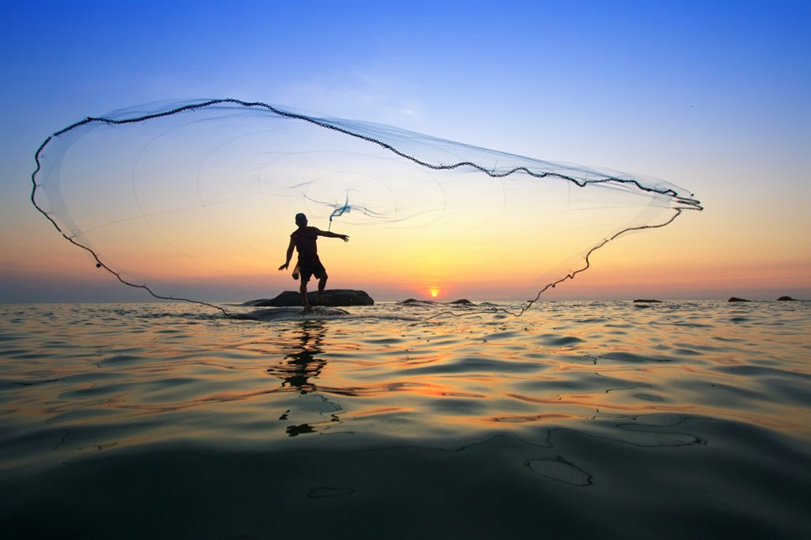

 

  

##Background
Conservation International Hawaii is partnering with the National Oceanic and Atmospheric Administration Integrated Ecosystem Assessment team (https://www.pifsc.noaa.gov/kona_iea/) to better understand Hawaii’s ocean health. We are working with stakeholders and ocean managers to develop the Ocean Health Index for West Hawaii. Community and public input is sought throughout this process to ensure that our assessment of ocean health is accurate and supports the priorities of the community of West Hawaii. 

The Ocean Health Index is the first integrated assessment framework that scientifically combines key biological, physical, economic, and social elements of the ocean’s health. Overall Index scores are a combination of ten components, or ‘goals’, of ocean health. These scores are calculated using the best available data and indicators at the scale of the assessment. Scores reflect how well coastal regions optimize their potential ocean benefits and services in a sustainable way relative to a reference point (target), on a scale of 0-100. 
Methods for calculating the Ocean Health Index were developed at a global scale, combining dozens of data sets to produce annual Index scores for coastal nations and territories. As a result, for the first time, we are able to assess and compare global performance in managing our relationship with the Earth’s greatest resource—the Ocean.  The global business community celebrated this accomplishment when the World Economic Forum recognized the Index as one of two innovative ocean solutions on June 8th, 2013.  

Using the same framework, independent assessments (OHI+) allow for exploration of variables influencing ocean health at the smaller scales where policy and management decisions are made. Targets for goals are created using stakeholder input, higher resolution data, indicators, and priorities, which produce scores that better reflect local priorities. This enables communities, managers, policy makers, scientists to better and more holistically understand, track, and communicate the status of local marine ecosystems, and to design strategic management actions to improve overall ocean health. 

## Goal
Our goal is to build a scientifically robust index of ocean health for Hawaii that is supported by local stakeholders and integrated into ongoing policy initiatives to support sustainable ocean management. We are working within the Ocean Health Index framework to facilitate repeatable assessments of the index goals overtime allowing for progress toward a common vision for a healthy ocean and sustainable ocean management.  

## Scale of Assessment
The Hawaii OHI+ will use the scientifically robust framework of the Ocean Health Index at the scale of the Hawaiian archipelago. We will focus our development of the Hawaii Ocean Health Index at two scales:
1)	The West Hawaii region; and
2)	Statewide, for coastal waters.

The Hawaii statewide assessment which will focus on the Main Hawaiian Islands and will be at the island scale. Regions will be Hawaii, Maui, Molokai, Lanai, Oahu, and Kauai. The island scale is used to designate districts of Hawaii, which are used in policy and management for the State of Hawaii. 
To produce the spatial boundaries of these reporting units we use the Hawaii USA Exclusive Economic Zones (EEZ). A nearshore spatial scale is computed as the offshore 3nm boundary for Hawaii islands to be used in some goals. The OHI focus is on the entire EEZ, however, some goals are assessed on the nearshore (3 nm scale). 

## Developing the Index
The process of developing and adapting the OHI for West Hawaii is extremely important for creating a culturally, socially, and ecologically appropriate tool for measuring ocean health in West Hawaii. The Ocean Health Index is being adapted to meet the needs of West Hawaii and Hawaii with the support of local experts, stakeholder surveys, workshops and community meetings and integration with ongoing initiatives. This website will also serve as a communication platform for the development of the Ocean Health Index to be able to better communicate with all stakeholders.

   

